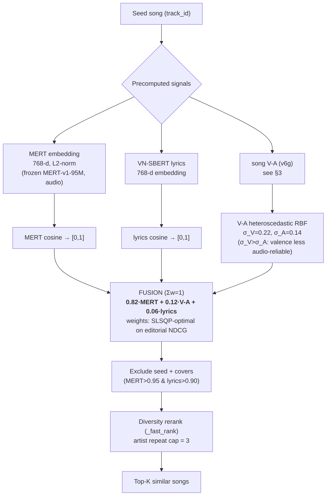
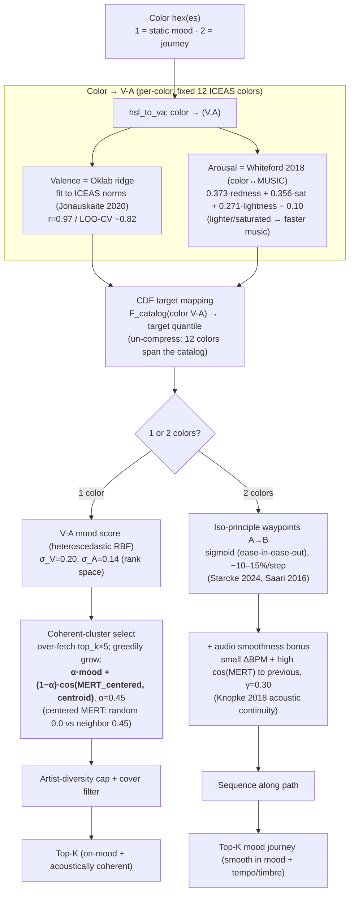
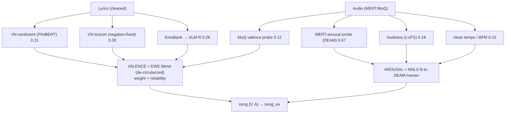

# Recommendation Pipelines — Flow Diagrams

Flow diagrams (Mermaid) for the two features, annotated with signals, weights, and the
research basis. Renders on GitHub / most Markdown viewers. State = current serving (V36–V39, v6g).

---

## 1. Recommend-by-Song (similar song)

**Why:** MERT dominates (0.82) because timbre/genre/energy define "sounds alike" (MARBLE);
V-A (0.12) keeps mood coherent (ablation: removing it collapses mood-coherence); lyrics (0.06)
a minor semantic cue (noisier). Timbral/rhythmic/tonal/instrument/mood slots = weight 0
(Essentia degenerate at 44.1 kHz / redundant). Learned metric+fusion heads were trained &
evaluated (Phase 1) but did **not** beat this baseline → not adopted (honest negative result).

---

## 2. Recommend-by-Color

**Why:** color↔music is mediated by V-A (Palmer 2013, Whiteford 2018) → V-A picks WHICH mood;
CDF fixes "every color feels mid" (raw color arousal spans a narrow band); MERT-coherence makes
a color's songs "feel alike" (V-A alone can't carry timbre); the journey follows the iso-principle
plus DJ-style acoustic continuity. `color_to_emotion_probs` (the "why" chip) uses a separate
ICEAS emotion table — unaffected by the arousal model.

---

## 3. song V-A (v6g) — shared sub-pipeline (feeds both features)

**Why:** music-emotion research — **valence ← lyrics** (stronger), **arousal ← audio** (~.81, Eerola).
EWE weights (Grimm & Kroschel) = signal reliability, no LLM target → de-circularized. Validated:
PMEmo cross-corpus transfer V 0.69 / A 0.65; independent refs (CLAP-ears arousal 0.48, XLM-T
valence 0.59); GPT 0.71 / Gemini 0.64.

---

### Legend
- All embeddings frozen + L2-normalized; probes are linear (MARBLE protocol — no fine-tune).
- Weights cited + validated offline (NDCG/FDR/bootstrap CI/ablation); no user data; LLM offline-only.
